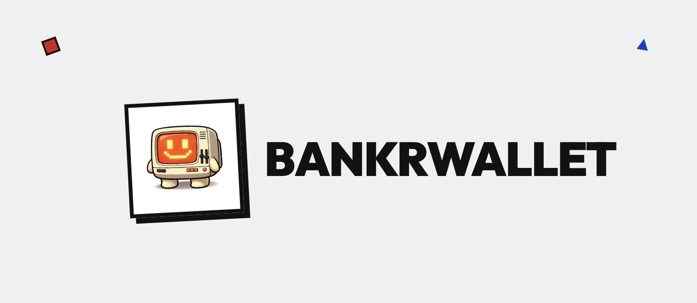
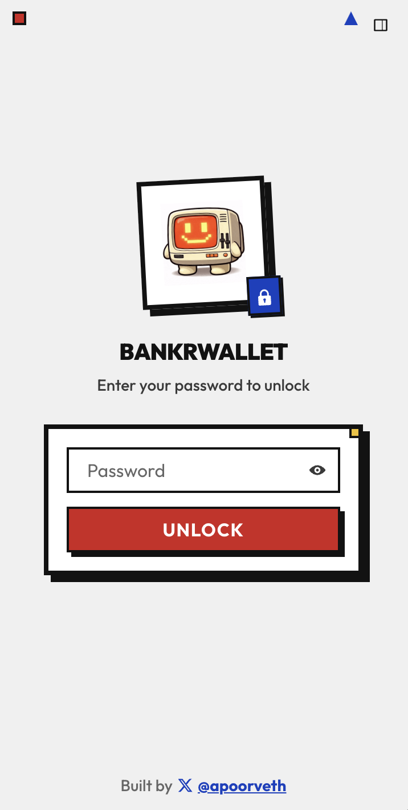
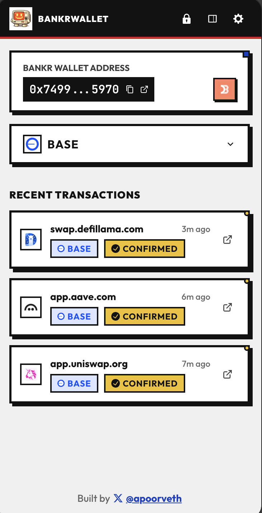

# BankrWallet

<p align="center">
  
</p>

<p align="center">
  <b>Pull your BankrWallet out of the Terminal and into your browser to use with Any Dapp, just like Metamask!</b>
</p>

<table>
  <tr>
    <td></td>
    <td></td>
    <td></td>
  </tr>
</table>


## Features

- **Transaction Execution** - Submits transactions through the Bankr API
- **Works in Browser Side Panel** - Keep the wallet in sight for quick access, and no popups!
- **Multi-Chain Support** - Base, Ethereum, Polygon, and Unichain
- **Per-Tab Chain State** - Different chains in different browser tabs
- **Transaction History** - Track your recent transactions with status updates
- **Browser Notifications** - Get notified when transactions complete
- **EIP-6963 Compatible** - Works alongside other wallets with modern dapp discovery
- **Secure Storage** - API key encrypted with AES-256-GCM

## Installation

### Download

1. Go to the [latest release](https://github.com/apoorvlathey/bankr-wallet/releases/latest) on GitHub
2. Download the `bankr-wallet-vX.Y.Z.zip` file from the release assets (e.g., `bankr-wallet-v0.1.0.zip`)
3. Extract the zip file to a folder on your computer

### Chrome / Brave / Arc


1. Open your browser and navigate to the extensions page: `chrome://extensions`
2. Enable **Developer mode** (toggle in the top-right corner)
3. Click **Load unpacked**
4. Select the extracted folder containing the extension files

## Getting Started

1. Install the extension
2. Click the Bankr Wallet icon to open the onboarding wizard
3. Enter your Bankr API key (get one from [bankr.bot](https://bankr.bot/api))
4. Enter your wallet address corresponding to the API key (supports ENS)
5. Create a password to secure your API key
6. Connect to any dapp and start transacting!

## Development

### Prerequisites

- Node.js (see `.nvmrc` for version)
- pnpm

### Building from Source

```bash
# Install dependencies
pnpm install

# Build the extension
pnpm build

# The built extension will be in the `build` directory
```

## Architecture

For detailed implementation documentation, see [IMPLEMENTATION.md](IMPLEMENTATION.md).

## Security

- API key is encrypted using AES-256-GCM with PBKDF2 key derivation (600,000 iterations)
- Password is never stored, only used to derive encryption key
- Decrypted API key is cached in memory with configurable auto-lock timeout
- Every transaction requires explicit user confirmation

## License

MIT

## Author

Built by [@apoorveth](https://x.com/apoorveth)
